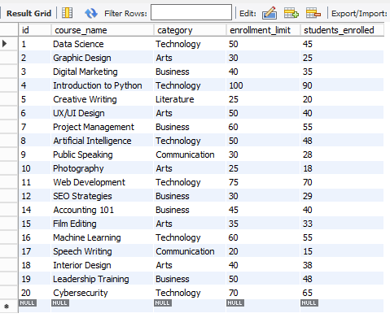
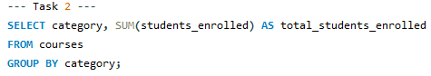
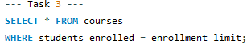
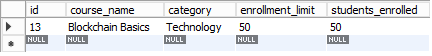
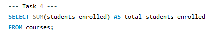
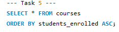
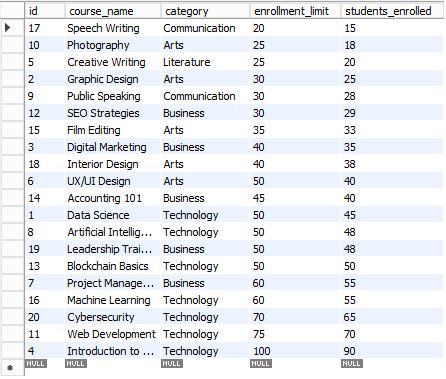

#Finals Task 3-1 Using MYSQL CLAUSE

## Task 1:
- Retrieve all courses where students enrolled is less than the enrollment_limit.
## Task 2:
- Group courses by category and calculate the total number of students enrolled for each category.

## Task 3: Retrieve the courses that are fully enrolled (i.e., students enrolled equals enrollment_limit).

## Task 4: Calculate the total number of students enrolled across all courses.

## Task 5: Sort courses by students enrolled in ascending order.

## Query Statements & Table Structure:
### Task 1:
#### Query:

#### Table:

### Task 2:
#### Query:

#### Table:

### Task 3:
#### Query:

#### Table:

### Task 4:
#### Query:

#### Table:

### Task 5:
#### Query:

#### Table:

